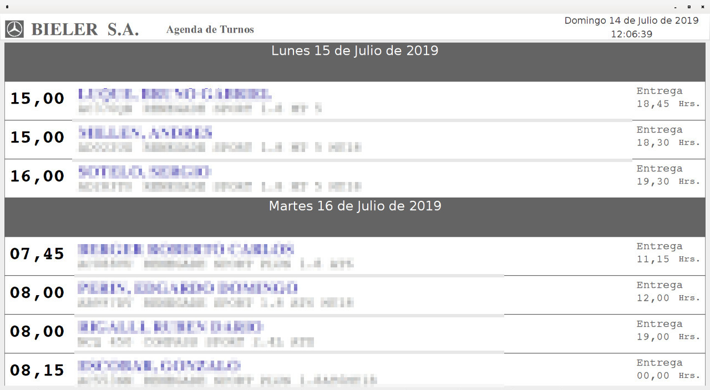
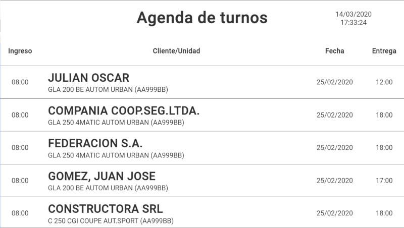

# ePanel v1.0.0
Un panel que visualiza información de los turnos otorgados, intercalados con imágenes.


<!--  -->
[](./assets/epanel-1.0.0.mp4)

- La información de los turnos se realiza directamente el motor de base de datos (MSSQL) de forma periódica.
- Las imágenes se obtienen de un repositorio de Google Drive.

## Back-end
El back-end es un API Rest hecho en Servidor [Node.js](https://nodejs.org/)

### Instalación
 - Instalar node
 ```bash
 cd /opt
 sudo wget https://nodejs.org/dist/v12.16.1/node-v12.16.1-linux-x64.tar.xz
 sudo tar xvf node-v12.16.1-linux-x64.tar.xz
 sudo rm node-v12.16.1-linux-x64.tar.xz
 sudo ln -s node-v12.16.1-linux-x64 node
 ```
 Es necesario tenes agregado `PATH="/opt/node/bin::$PATH"` en el archivo `~/.bashrc`

 - Clonar este repositorio.

 - En el directorio `backend` ejecutar `npm install`

 - instalar PM2
 ```bash
 npm install -g pm2
 ```
 Establecer el servicio

 ```bash
 $ pm2 start server.js
 $ pm2 startup
 ```

### config.json
Es necesario generar el archivo `backend/config/default.json` el cual tiene el
siguiente formato.

  ```json
  {
    "panel-name":"sfe-001",
    "node_port": 5555,
    "json_indentation": 4,
    "mssql": {
      "user": "your_user",
      "password": "your_passwoed",
      "server": "your_server_ip",
      "database": "your_database",
      "query": "SELECT * FROM TURNOS"
    },
    "drive": {
      "user":"",
      "password":""
    }
  }
  ```

  If you use Microsoft SQL Server 2005 append this lines in "mssql" section
  ```json
  "options": {
    "encrypt": false,
    "instanceName": "intance"
  }
  ```

### No such file or directory, open 'credentials.json'
Para poder descargar las imágenes de Google Drive, necesitamos generar las credenciales necesarias y dar permiso de acceso al script.
Para esto tenemos que ingrezar a la (Consola de APis de Google)[https://console.developers.google.com/apis/dashboard] y gestionar dicha credencial

Una vez que tengamos el archivos 'credentials.json'  ejecutamos `node medias.js` y por única vez nos solicitara ingresar a una URL donde daremos permisos y nos devolvera un codigo que ingresaremos en la consola para generar el *Token*

```
Authorize this app by visiting this url: https://accounts.google.com/o/oauth2/v2/auth?access_type=offline&scope=https%3A%2F%2Fwww.googleapis.com%2Fauth%2Fdrive%20https%3A%2F%2Fwww.googleapis.com%2Fauth%2Fdrive.file%20https%3A%2F%2Fwww.googleapis.com%2Fauth%2Fdrive.readonly%20https%3A%2F%2Fwww.googleapis.com%2Fauth%2Fdrive.metadata.readonly%20https%3A%2F%2Fwww.googleapis.com%2Fauth%2Fdrive.appdata%20https%3A%2F%2Fwww.googleapis.com%2Fauth%2Fdrive.metadata&response_type=code&client_id=687392414212-tm3nmp30lr9rjajsna8n6grqe7jjm6m2.apps.googleusercontent.com&redirect_uri=urn%3Aietf%3Awg%3Aoauth%3A2.0%3Aoob
Enter the code from that page here: [CODIGO]
Token stored to token.json
```

En las próximas ejecuciones no sera necesario la intervención del usuario. Por otra parte si ya tenemos los archivos "credentials.json" y "token.json" de otra instalación los podemos copiar.

## Frontend
El front-end es una aplicación [React](https://es.reactjs.org/) corriendo en Elextron en modo kiosko.
Solo hace falta copiar el directorio `dist/linux-unpacked` y ejecutar `./epanel --no-sandbox`

### Acerca de Electron
[electron](https://electronjs.org/)

To run the aplication you need:
1. In the *frontend* folder run `yarn build`. This command generate *build* folder
2. In the root folder run `electron .`

If you want to package and build a ready for distribution Electron app for macOS, Windows and Linux, yuo can use *electron-builder*

...chrome-sandbox is owned by root and has mode 4755.<br>
sudo sysctl kernel.unprivileged_userns_clone=1<br>

### electron-builder
[electron-builder](https://www.electron.build/)

```
electron-builder build  --windows dir
```
